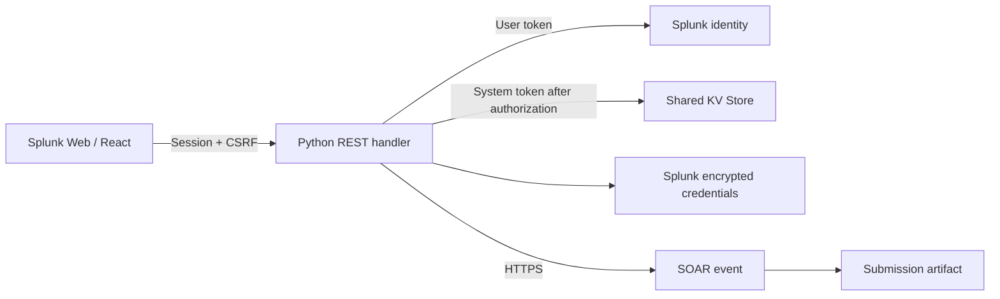

# ActionStack for Splunk

[Source and issues](https://github.com/Shorton88/ActionStack) · [Contributing](CONTRIBUTING.md) · [MIT license](LICENSE)

A native Splunk app for turning authenticated form submissions into Splunk SOAR events, designed for Splunk Enterprise search head clusters and on-premises Splunk SOAR. The original deployment targets were Enterprise 10.2.4 and SOAR 8.6; other versions require compatibility verification in your environment.

**Release 0.5.1: implemented and tested locally. The operator confirmed successful SOAR intake after creating the configured label; full cluster acceptance remains required.**

## Included

- React interface with saved Dark, Light and System themes, plus iridescent accents.
- Role-filtered catalog with categories, search, pagination, personal favorites, direct form links, review and receipts.
- Admin builder with 15 field types, conditions, defaults, validation, drag/keyboard reordering, label/tag mapping, role access, drafts, publishing, history, cloning, collapsible sections, archive, delete and Trash restore.
- Multiple-value text chips and single/multiple lookup selections, passed to SOAR as structured arrays. Lookup SPL supports read-only transformations and separate value/display-label fields.
- Per-field equals, not equal, like, not like and regex checks, with custom error messages.
- Local demo / existing installation Block an object template: IPv4/IPv6, domain, SHA-1/SHA-256; 4 hours, 1 day, 30/60/90 days, or Forever.
- Python REST backend: trusted Splunk identity, effective role checks, immutable form revisions, shared KV Store, encrypted credentials, verified HTTPS, duplicate reconciliation, manual retry, and audit metadata.
- SOAR event + submission artifact with typed inputs and server-derived attribution. The starter form defaults to SOAR-playbook approval for Forever requests.
- An Approvals tab for every-request or conditional rules, with trusted approval metadata for your downstream playbooks.
- Read-only playbook/action status, summaries and collapsed result data on receipts, refreshed while open, with explicit unavailable/permission states.

Playbooks, Teams approval execution, actual security-product blocking, and automatic unblocking are outside this release. No new SOAR connector is required: the app calls SOAR's container and artifact REST APIs. The existing Teams app is documented in `TEAMS_INTEGRATION_REFERENCE.md`.

## Preview locally

Requires Node 20.19+ or 22.12+ and Python 3.9+. Install dependencies with `npm ci`.

In two terminals:

```sh
python3 scripts/dev_server.py
```

```sh
npm run dev
```

Open **http://127.0.0.1:5173**. The preview uses a fixed demo administrator and local SQLite storage under `.dev-data/`. It simulates SOAR delivery, even if connection values are entered. Never use this development server as a deployment or enter real credentials into it.

The native Splunk bundle contains neither the demo server nor demo data. It uses the authenticated Splunk session and actual configured SOAR connection.

## Verify and package

```sh
npm test
npm run package
```

Output: `dist/splunk_actionstack-0.5.1.spl` and a SHA-256 checksum. Node is only needed to build; the installed app uses bundled browser assets and Splunk's Python runtime. The app header displays this release version automatically from package metadata.

See **[DEPLOYMENT.md](DEPLOYMENT.md)** for SHC installation, capabilities, connection setup, acceptance tests, retention, and recovery. Do not install the bundle individually on SHC members. GitHub Actions also tests and builds the app; successful runs provide an install bundle and checksum under **Actions → CI → Artifacts**. Generated bundles and local data are not committed to source control.

## Architecture



The handler records a request before delivery. Unique submission keys and shared delivery locks coordinate competing search heads. A retry reconciles each stage by source identifier. There is no background worker or automatic retry schedule; receipts expose retries to the original requester.

## Files

| Location | Purpose |
| --- | --- |
| `frontend/src/` | UI and typed API client |
| `splunk_actionstack/bin/actionstack/` | Validation, application service, Splunk/SOAR adapters |
| `splunk_actionstack/default/` | Native app, endpoint, roles, view, and KV configuration |
| `scripts/dev_server.py` | Local-only demo |
| `scripts/package_app.py` | Reproducible package generation |
| `tests/` | Isolated validation, authorization, concurrency, and delivery tests |
| `SOAR_EVENT_CONTRACT.md` | Downstream field contract |
| `examples/` | Generated illustrative container/artifact payloads |

## Verification boundary

Automated tests use isolated SQLite stores and simulated SOAR responses. Browser checks cover local submission, review, conditional hash fields, custom-form creation/publishing/preview, the approval editor, the dark submission footer, and simulated run-status rendering. These do not validate Splunk's persistent-handler transport, KV failover consistency, credential replication, SOAR permissions, or actual playbook triggering. The runbook includes those staging checks. This release has not undergone Splunk AppInspect or production load testing.


### Workspaces, fields and catalog (0.2.0)

Use **Team workspaces** to manage membership and the workspace selector to switch teams. The home page is a searchable catalog with categories, 12 items per page, and personal favorites stored in shared KV Store.

In **Form builder → Build**, select a field and open **Validation** in its properties. Add Equals, Not equal, Like, Not like or Regex checks, each with a value and error message. Like patterns use `*` for any text and `?` for one character and are case-sensitive. Regex matches the whole value; `(?i)` enables case-insensitive matching. Required remains a field setting. Existing policy rules migrate into their fields on opening the editor; publish to activate the changes. There is no policy management page or selector.

Add **Text · multiple values** for Enter-to-add chips, or **Lookup · multiple values** to select several lookup results. **Lookup · single value** remains available. Multi-value fields allow up to 25 unique items; each item is validated. Lookup fields use `| inputlookup identity_lookup_expanded | fields identity` with the requester's permissions. Array values are available in both the container and artifact custom data; CEF projections contain JSON text. See [SOAR_EVENT_CONTRACT.md](SOAR_EVENT_CONTRACT.md).

**Delete** moves a form out of the catalog and normal builder list into **Trash**. Publishers with edit access can restore it, then explicitly publish it again. Existing receipts remain accessible; deletion does not remove remote SOAR events.

Deploy the full 0.2.0 bundle through the SHC deployer, including the new `actionstack_favorites` collection. Hard-refresh Splunk Web. See [deployment details](DEPLOYMENT.md#11-field-validation-and-catalog-upgrade-020).

### Form icons (0.2.1)

In **Form builder → Settings**, choose a **Form icon**: Shield, Workflow, Search, Document, Globe or Lightning. Save a draft to retain the choice; publish to update catalog cards and the live form header.

### Action result data (0.2.1)

In submission details, expand **Result data** beneath an action to view its `action_result.data`, including actions that do not return a summary. Summaries remain separate. Data starts collapsed and refreshes with the action status. Large results show a limited preview; open SOAR for the complete output. No form republishing is needed.


### Workspace setup and preferences (0.3.0)

Fresh installations open **Setup wizard** for an app administrator. Create a workspace, optionally create `as_<namespace>_viewer`, `as_<namespace>_user` and `as_<namespace>_admin` roles, then save and test the SOAR connection and choose an event label prefix. New production installations start without a published example form. Existing installations retain their forms and workspace data; the wizard is also available from the sidebar.

Workspace role mappings supply permissions for **new forms**: viewers read all workspace submissions; users also submit; workspace admins also edit and publish. Assign the generated roles to your users or identity-provider groups in Splunk. Existing roles can be selected instead; their app capabilities must already be assigned. No app-wide administration or search access is added by these generated roles.

**Submissions** starts with the current workspace's authorized receipts. Choose **My submissions** to filter by your signed-in identity. Workspace filtering happens before the 200-receipt limit.

**Form builder → Settings** contains icons, eight iridescent colors with a preview, permissions and the form ID. New IDs follow the title with a four-character suffix until the first save or manual edit. **SOAR mapping** lists existing labels matching the configured prefix. **Preview → Test validation** runs the same backend field and lookup checks as submission, without creating an event.

Choose **Dark**, **Light**, or **Use system** in the sidebar. Preferences are private to the signed-in Splunk user and stored in shared KV Store. Deploy the complete 0.3.0 package through the SHC deployer, including the new `actionstack_preferences` collection, then hard-refresh Splunk Web. See [upgrade details](DEPLOYMENT.md#12-workspace-setup-and-preferences-upgrade-030).
