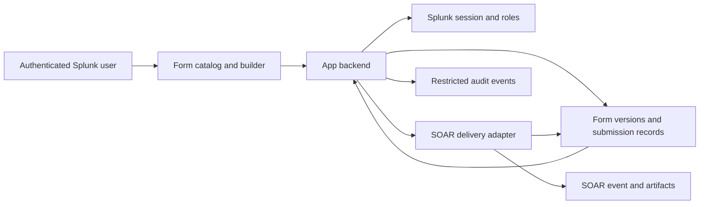

# Splunk ActionStack — implementation requirements

Status: implemented for local testing in release 0.1.0; live integration validation remains pending. See README.md and DEPLOYMENT.md for implemented behavior and limits.
Updated: September 15, 2026.

## 1. Confirmed objective and environment

Build a modern Splunk app where authenticated users submit administrator-defined forms to Splunk SOAR as events containing the form values and submission details.

- Splunk Enterprise **10.2.4**, on premises, **search head cluster**.
- Splunk SOAR **8.6**, on premises.
- Users authenticate through existing Splunk accounts; permissions use Splunk roles.
- React-style interface with clean dark mode and restrained iridescent accents.
- Administrators create and publish custom forms and choose the SOAR label and tags.
- First template: **Block an object** with IP, domain, SHA-1 or SHA-256 and a requested duration.
- Completion boundary: **the SOAR event and required artifacts exist with the expected data**.

The user's SOAR playbooks own automation, Teams approvals, product enforcement and timed removal. The initial app records delivery status. Approval decisions, active-block tracking, product connectors, dispatcher playbooks and execution-result synchronization are future work owned separately from this implementation.

Reference documents:

- [Initial blocking form](BLOCK_OBJECT_WORKFLOW.md)
- [SOAR event contract](SOAR_EVENT_CONTRACT.md)
- [Existing Teams action reference](TEAMS_INTEGRATION_REFERENCE.md)

## 2. Architecture

Use a **React/TypeScript frontend packaged as a Splunk app**, with Python REST handlers for trusted submission and administration. Splunk provides React tooling and scaffolding. [Splunk UI Toolkit](https://splunkui.splunk.com/Toolkits)

| Component | Responsibility |
| --- | --- |
| Frontend | Catalog, form rendering, builder, own-submission history and delivery receipt |
| Python backend | Session identity, capability checks, form policy, validation, payload assembly |
| Splunk KV Store | Shared storage for form drafts/versions and modest submission volume |
| SOAR adapter | HTTPS delivery, credential use, correlation, retry and partial-delivery recovery |
| Audit output | Form changes, submissions, delivery outcomes and authorized retry actions |
| SOAR | Stores events/artifacts for the user's existing or future playbooks |

Use a bounded delivery attempt after persisting the submission. Persist stage and object IDs so retries resume the same request. Any automatic retry worker must have a supported deployment/ownership model; KV Store alone does not establish a distributed queue. This release uses unique KV inserts for revision conflicts and delivery locks across SHC members; actual failover behavior must be validated in staging.

The first integration proof must use the actual Splunk and SOAR versions. Validate Python compatibility against Splunk 10.2.4 configuration and its installed runtime. The version-specific REST configuration supports method-level capability checks. [Splunk 10.2.4 restmap.conf](https://help.splunk.com/en/splunk-enterprise/administer/admin-manual/10.2/configuration-file-reference/10.2.4-configuration-file-reference/restmap.conf)

## 3. Included product features

### Catalog and form completion

- Role-filtered catalog with descriptions, categories, search and stable form links.
- Field types: text, multiline text, number, email, URL, date/time, select, multiselect, radio and checkbox.
- Required/default values, length/range constraints, examples, help text and sections.
- Simple conditional visibility and required rules, including the hash-algorithm selector.
- Server-side validation against the exact published form version.
- Clear confirmation with submission ID and SOAR event ID/link after complete delivery.
- My submissions with authorized detail views and delivery states.
- Browser refresh or retries preserve the submission identity.

### Form builder

Three-column editor: **field palette | live canvas | field properties**. Include keyboard add/reorder controls alongside drag-and-drop.

Tabs: **Build · SOAR mapping · Access · Versions**.

| Area | Required behavior |
| --- | --- |
| Build | Add/reorder/duplicate fields, stable keys, sections, constraints and conditions |
| SOAR mapping | Configure the shared connection’s label/tags, event title prefix, metadata defaults, optional CEF mapping |
| Access | Select existing Splunk roles for viewing/submitting and authorized team access |
| Versions | Draft, preview, publish, archive, version history and restore |

Published versions are immutable; edits create a draft. Preview uses the live renderer with no network submission. Use a dedicated test form/label for deliberate intake verification.

Validate schema, role references, mapping configuration, and label availability from SOAR container options before publish. Connection tests validate read access; an intake test proves write permissions. Version checks prevent silent overwriting of another admin's edits. Definitions remain declarative; arbitrary code and unrestricted remote data sources are excluded.

A form does not need a playbook identifier or dispatcher to publish. Label/tag settings form the handoff contract to SOAR.

## 4. SOAR event ingestion

Create one container (normal SOAR event) per logical submission, with a submission artifact exposing useful fields to playbooks. Preserve all accepted typed inputs in a namespaced JSON envelope. Optional observable artifacts and CEF mappings improve downstream use.

SOAR 8.6 documents container and artifact creation through its REST API, so a new SOAR ingestion connector is unnecessary for the proposed push approach. [SOAR 8.6 containers](https://help.splunk.com/en/splunk-soar/soar-on-premises/rest-api-reference/8.6.0/container-endpoints/rest-containers), [SOAR 8.6 artifacts](https://help.splunk.com/en/splunk-soar/soar-on-premises/rest-api-reference/8.6.0/artifact-endpoints/rest-artifact)

Required event information:

- Unique submission ID and originating app identifier.
- Form ID, title, published version and stable field keys.
- Server-recorded UTC submission time.
- Authenticated Splunk username and effective-role snapshot.
- Optional display name/email only when available from a trusted profile.
- Complete validated inputs, preserving data types.
- Server-selected label/tags and mapping version.
- Policy metadata relevant to downstream automation, such as approval required.
- SOAR source identifier for duplicate detection/correlation.

The frontend submits values and a form/version reference. The backend derives identity, routing and policy fields. User-entered identity or routing fields remain ordinary input and cannot overwrite trusted metadata.

For the first template, label `automation_requests` and tag `automation:block_object` are suggested configurable values. Labels participate in native automatic playbook selection; tags can be inspected by the user's playbooks. The app does not implement that selection logic.

### Automation trigger setting

Admin configuration controls whether artifact ingestion permits SOAR automation. Stage all required data before any trigger. Use explicit `run_automation: false` during ingestion-only testing. When the owner enables triggering, allow automation on the final artifact only. Do not explicitly invoke a playbook.

SOAR's combined container/artifact POST has automatic triggering behavior; the proposed sequential protocol makes the trigger boundary explicit. Validate this against SOAR 8.6 before release. [SOAR 8.6 artifact ingestion](https://help.splunk.com/en/splunk-soar/soar-on-premises/rest-api-reference/8.6.0/artifact-endpoints/rest-artifact)

## 5. Delivery reliability and user-facing states

Use **Pending delivery**, **Submitting**, **Submitted to SOAR**, **Delivery failed**, and **Needs attention**.

“Submitted to SOAR” means the container and every required artifact are confirmed. It conveys delivery, with downstream automation owned by SOAR.

- Save the request before sending and record every confirmed remote ID.
- Scope an idempotency key to the authenticated user and form ID; bind it to the submitted version and original input body. This retains replay identity across a subsequent publication.
- Same key/same content returns the existing submission; same key/different content is a conflict.
- Distinguish transient connection errors from invalid payloads and authorization failures.
- Reconcile a timeout against recorded source identifiers before creating another object.
- If the event exists but an artifact failed, retain the event ID and resume missing stages.
- Persist delivery attempts and sanitized error details. Operator retry preserves the submission ID.
- Recheck current authorization and form policy for delayed/manual delivery; keep historical identity for audit.
- Do not expose SOAR credentials or internal exception traces to users.
- A successful delivery receipt does not claim approval, blocking, expiry or playbook completion.

## 6. Splunk RBAC and data protection

Implemented custom capabilities, assigned through existing Splunk roles:

| Capability | Purpose |
| --- | --- |
| `actionstack_use` | Open permitted forms and the catalog |
| `actionstack_submit` | Submit permitted forms |
| `actionstack_read_team` | Read explicitly scoped team submissions |
| `actionstack_edit` | Edit authorized form drafts |
| `actionstack_publish` | Publish versions and SOAR mappings |
| `actionstack_admin` | Configure integration and recovery |
| `actionstack_audit` | Read permitted audit metadata |

Grant baseline use/submit access to the roles covering authenticated users, matching the initial blocking-form policy. Both temporary and Forever requests can be ingested; Forever carries an approval-required flag for downstream handling.

Enforce both capability and form/object access on every backend endpoint. Read identity from the authenticated Splunk session, and enforce ownership on submission detail/retry APIs. Direct KV Store or lookup access must not bypass these rules; restrict backing collections appropriately. Audit metadata is retained in restricted KV storage with a capability-checked API; a searchable external audit export is an operator integration.

Store the SOAR token server-side in approved encrypted credential storage. Use verified TLS by default and a restricted SOAR automation identity. App admins may explicitly disable certificate validation for the SOAR connection; HTTPS remains required, and this does not alter system trust. Include CSRF protection, request-size/rate limits, integration destination allowlists, safe rendering and retention rules. Log essential metadata with sensitive input redacted.

## 7. Design direction

- Graphite background, slate panels, subtle borders and readable neutral text.
- Cyan/violet/pink iridescent accents on primary actions, selection and active navigation.
- Sidebar: **Automations**, **My submissions**, and role-dependent **Form builder**, **Settings**.
- Focused single-column user forms; desktop-first editor.
- Accessible labels, keyboard focus, inline errors, reduced motion and verified contrast.
- Submission receipt gives the SOAR event ID and a permission-checked navigation link.
- Builder and delivery errors explain what the user can correct.

## 8. Implementation sequence and acceptance

1. Package a minimal app on Splunk 10.2.4 and verify the real session/role context.
2. Implement the Block an object template and authoritative validation.
3. Deliver its complete event/artifact payload to SOAR 8.6 and verify round-trip contents.
4. Add persistent receipts, duplicate handling and partial-delivery recovery.
5. Implement the reusable editor, publishing and form-level access.
6. Verify permissions, packaging, accessibility and recovery on the intended deployment.

Acceptance criteria:

- An admin can publish a new custom form without editing code or creating a playbook.
- A permitted user can submit it and find every accepted field plus server-derived attribution in SOAR.
- IP/domain/hash branches and all durations preserve their intended values.
- Label/tag mappings are applied by the backend and cannot be replaced by client input.
- Direct API calls cannot bypass role, form or own-submission checks.
- Duplicate or interrupted delivery reconciles to one logical submission and a complete payload.
- The UI reports delivery accurately, including partial/unknown outcomes.
- Versioned forms preserve the contract associated with past submissions.
- Ingestion succeeds with no task/dispatcher playbook installed.
- No SOAR token appears in frontend responses or general logs.

## 9. Remaining deployment inputs

Needed for live integration: SOAR URL and trusted CA, restricted token configured through setup, permitted intake label/source asset, effective production role names, retention and a test environment/label.

Product blocking actions and Teams approver setup are downstream details and do not block development of this form-to-event app.
